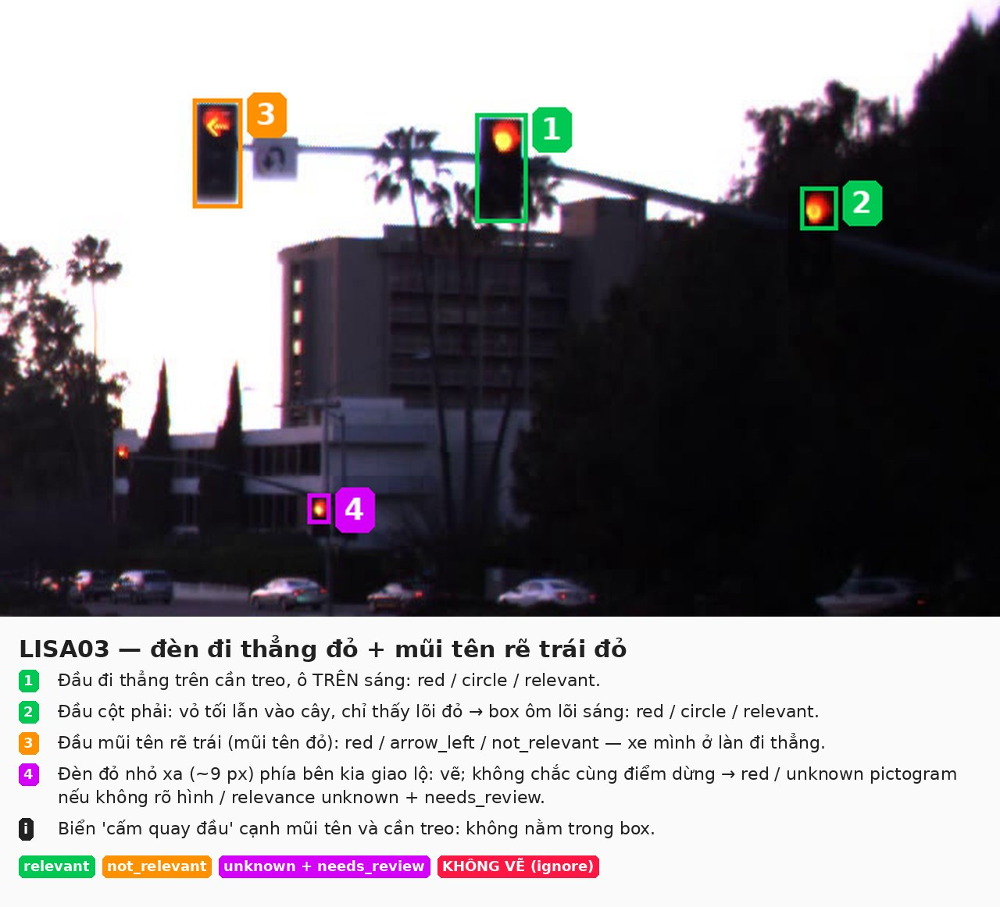
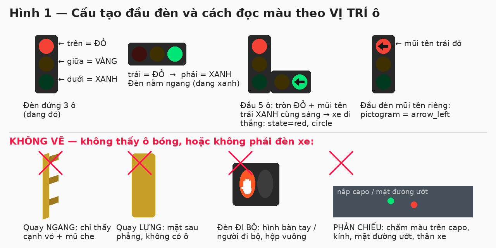
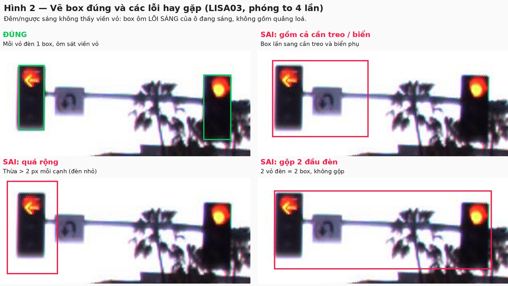
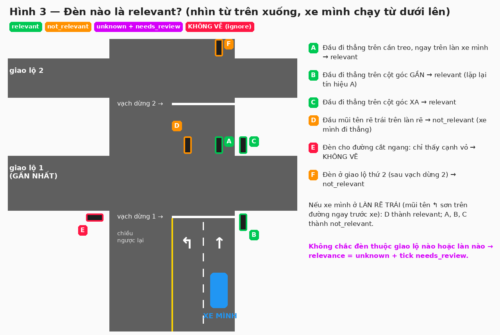
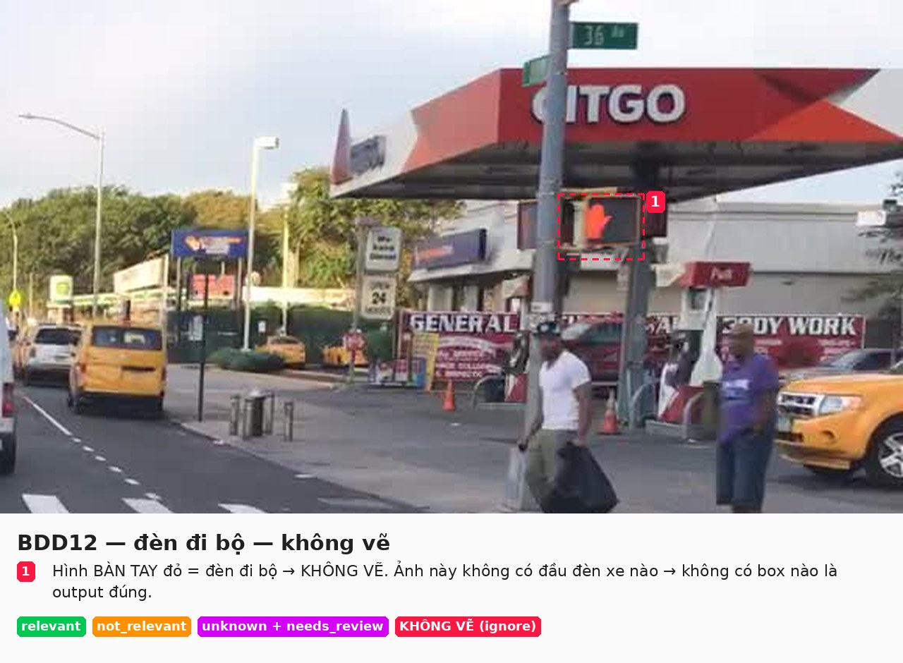
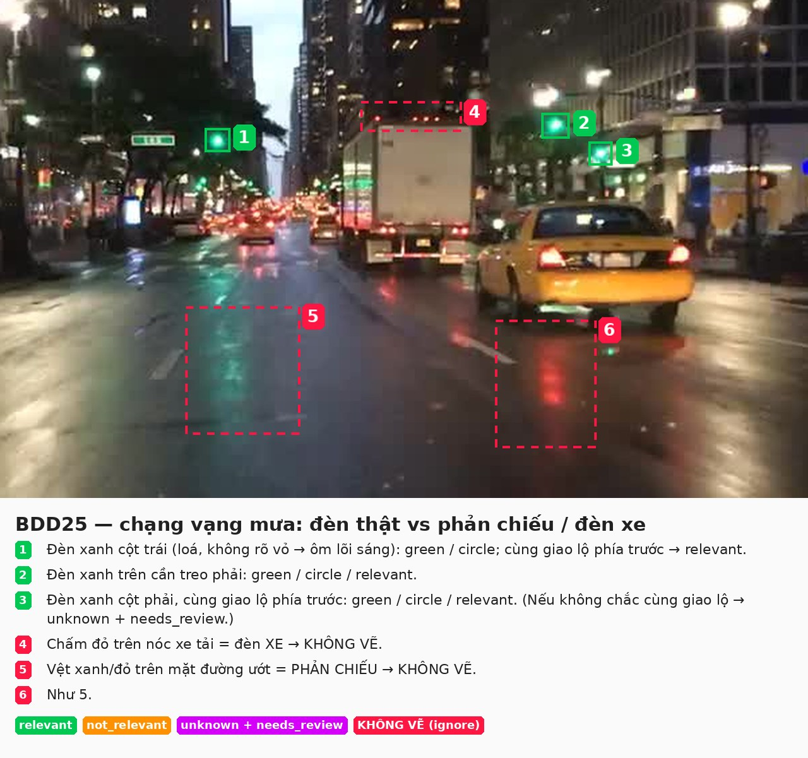
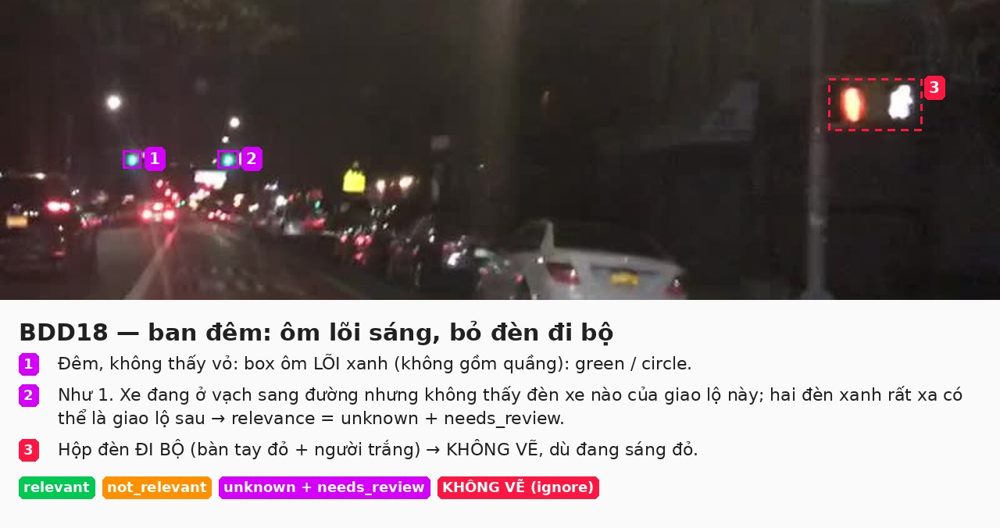
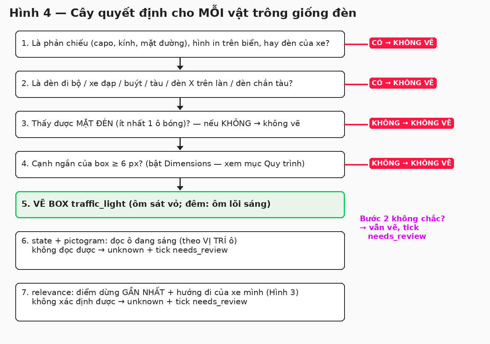
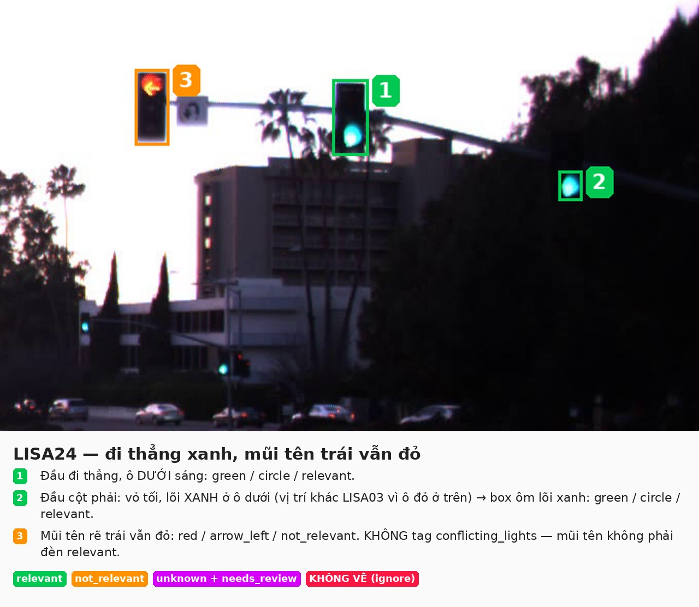
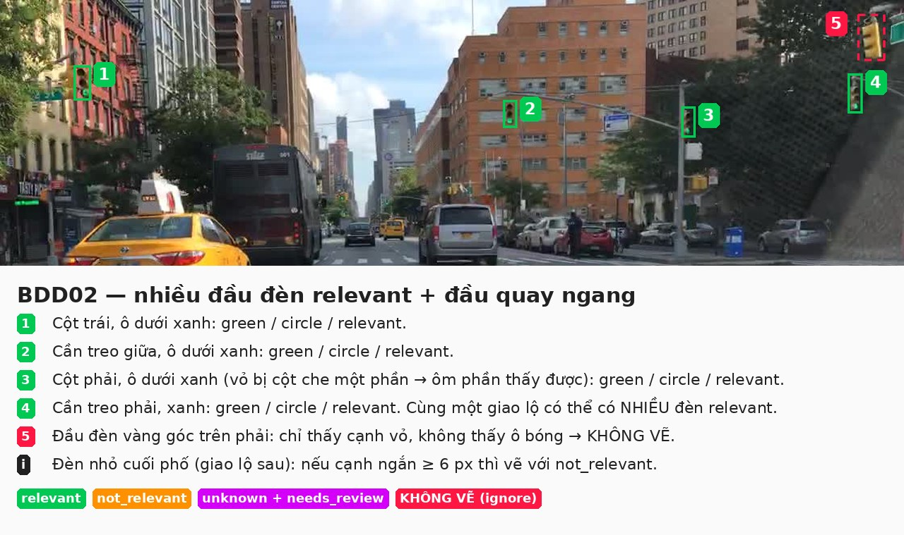

# Annotation guideline — Traffic light state + ego relevance

**Version:** v2

<!--
v0 = chưa có bản nháp. Đổi dòng Version ở trên thành v1 khi xong bản nháp đầu, v2 sau calibration, v3 sau blind
handoff; mỗi lần tăng version ghi một dòng vào 08_revision_log.md. `make freeze` đòi v2 trở lên.

File này là thứ nhóm peer nhận nguyên văn trong blind pack và là Guide dán vào CVAT. Peer KHÔNG nhận
edge_case_cards.md, gold_decisions.csv hay sample_pack.csv. Rule nào peer cần biết phải nằm ở đây.
No hidden rules: rule chỉ giải thích bằng miệng thì coi như không tồn tại.
Ví dụ trong guideline chỉ dùng ảnh split example hoặc calibration, không dùng ảnh blind.
-->

> **Về hình minh hoạ.** Các hình (`Hình 1` … `Hình 10`) nằm trong thư mục `02_guideline_figures/` cạnh file này.
> Nếu bạn **không thấy hình** (ví dụ khi đọc trong CVAT hoặc trong gói blind), chỉ cần đọc phần chữ và sơ đồ chữ:
> **mọi rule đều viết bằng chữ, hình chỉ để minh hoạ.**

## Tóm tắt 30 giây

1. Vẽ **một box `traffic_light` cho mỗi đầu đèn tín hiệu dành cho xe cơ giới mà bạn nhìn thấy mặt đèn** (các ô
   bóng), cạnh ngắn của box ≥ 6 px.
2. Gán 4 attribute cho mỗi box: `state` (màu đang sáng), `pictogram` (hình đang sáng), `relevance` (đèn có điều khiển
   xe mình không), `needs_review` (tick nếu không chắc).
3. `relevant` = đèn điều khiển hướng **đi thẳng** của làn xe mình tại **điểm dừng có đèn gần nhất phía trước**.
4. **Màu đọc theo VỊ TRÍ ô đang sáng**: ô trên = `red` (kể cả khi trên ảnh trông cam/vàng), giữa = `yellow`, dưới =
   `green`. **Xe mình luôn đi thẳng**, trừ khi thấy mũi tên rẽ sơn trên mặt đường ngay trước xe.
5. Không chắc → chọn `unknown` và **luôn** tick `needs_review`. **Không đoán.**
6. Không vẽ: đèn đi bộ/xe đạp, đèn quay ngang/quay lưng, mọi phản chiếu, đèn của xe cộ, hình đèn trên biển.
7. Không để sót `__undefined__`. Lưu (**Ctrl+S**) sau mỗi ảnh.

## Thuật ngữ

| Từ | Nghĩa |
|---|---|
| **Xe mình / ego** | xe gắn camera chụp ảnh. Ảnh luôn nhìn từ ghế lái xe mình ra phía trước |
| **Đầu đèn** | một vỏ đèn (hộp) chứa các **ô bóng** xếp dọc hoặc ngang. Một cột/cần treo có thể mang nhiều đầu đèn |
| **Ô bóng** | một ô tròn trong đầu đèn; ô đang sáng cho biết màu và hình tín hiệu |
| **Mặt đèn** | phía có các ô bóng. "Thấy mặt đèn" = thấy ít nhất một ô bóng |
| **Cần treo** | thanh ngang vươn ra giữa đường, đầu đèn treo trên đó |
| **Backplate / tấm hắt** | tấm viền (thường đen, có viền vàng) quanh đầu đèn — **không** tính vào box |
| **Vạch dừng** | vạch trắng ngang làn trước giao lộ/vạch sang đường, nơi xe phải dừng khi đèn đỏ |
| **Điểm dừng có đèn gần nhất** | giao lộ / vạch sang đường / lối vào cao tốc có đèn **đầu tiên** mà xe mình sẽ đi qua, hoặc giao lộ xe mình **đang ở trong** |
| **Làn chỉ-rẽ** | làn có mũi tên rẽ sơn trên mặt đường và **không** có mũi tên đi thẳng |
| **Lõi sáng** | phần sáng nhất, đặc của ô đang sáng, không gồm quầng loá xung quanh |

Màu dùng trong mọi hình minh hoạ: **xanh lá** = `relevant` · **cam** = `not_relevant` · **tím** = `unknown` +
`needs_review` · **đỏ nét đứt** = không vẽ.

## Chuẩn bị CVAT lần đầu (làm một lần, ~5 phút)

1. Mở CVAT, đăng nhập, vào **Jobs** (hoặc **Tasks** → task → dòng **Job #…**) để mở màn hình gắn nhãn.
2. Bấm tên tài khoản (góc trên phải) → **Settings** → tab **Workspace**:
   - bật **Always show object details**;
   - ở **Content of a text** chọn thêm **Dimensions** (và giữ **Label**, **Attributes**) → mỗi box sẽ hiện kích
     thước `rộng × cao` px ngay trên ảnh, dùng để kiểm ngưỡng 6 px;
   - bật **Enable auto save** nếu có (vẫn nên bấm **Ctrl+S** sau mỗi ảnh).
3. Màn hình gắn nhãn gồm: **thanh công cụ bên trái** (các công cụ vẽ), **ảnh ở giữa**, **sidebar bên phải** (tab
   **Objects** liệt kê box và attribute), **thanh trên cùng** (lưu, chuyển ảnh, nút **Guide**, chọn chế độ
   **Standard / Attribute annotation**). Tên file ảnh (ví dụ `LISA03.jpg`) hiện cạnh số frame trên thanh trên cùng.
4. Mở **Guide** đọc hết guideline này trước ảnh đầu tiên.

**Phím tắt cần nhớ:**

| Phím | Việc |
|---|---|
| lăn chuột | phóng to / thu nhỏ quanh con trỏ |
| giữ chuột trái trên nền ảnh rồi kéo | di chuyển ảnh |
| **N** | vẽ tiếp box với công cụ vừa dùng |
| **Del** | xoá box đang chọn |
| **Ctrl+Z** | hoàn tác |
| **Ctrl+S** | lưu |
| **F** / **D** | ảnh sau / ảnh trước |
| **↑ / ↓**, phím số, **Tab** | trong chế độ Attribute annotation: đổi attribute, chọn giá trị, sang box kế |

## Quy trình làm một ảnh

Làm đúng thứ tự này cho **mọi** ảnh:

| Bước | Làm gì | Thao tác CVAT |
|---|---|---|
| 1 | **Quét toàn ảnh**: phóng to khoảng 2–3 lần, đi từ trái sang phải theo dải ngang ở nửa trên ảnh (đèn thường ở đó) — **sát cả hai mép trái/phải** (đèn cột góc hay nằm sát toà nhà, cây) — rồi quét **dải ngang quanh đường chân trời** (đèn nhỏ ở giao lộ xa, đường cắt ngang), cuối cùng quét nửa dưới để phát hiện phản chiếu. Đếm số vật trông giống đèn | lăn chuột + kéo ảnh |
| 2 | Xác định **làn xe mình** và **điểm dừng có đèn gần nhất** (mục 4.3, Hình 3) | — |
| 3 | Với **từng** vật tìm được, chạy **cây quyết định** (mục 7, Hình 4). Kết luận LABEL thì vẽ box | thanh trái **Draw new rectangle** → **Label** chọn `traffic_light` → **Drawing method** giữ *By 2 points* → bấm **Shape** → click góc trên trái rồi góc dưới phải của vỏ đèn. Box tiếp: **N** |
| 4 | Kiểm từng box: kích thước (text **Dimensions**) và 4 cạnh ôm sát vỏ (mục 3, Hình 2). Chỉnh: kéo góc/cạnh | chọn box, kéo |
| 5 | Gán attribute cho **từng** box: `state` → `pictogram` → `relevance` → `needs_review` | thanh trên cùng đổi **Standard** → **Attribute annotation**: CVAT phóng to từng box; **↑/↓** chọn attribute, phím số chọn giá trị, **Tab** sang box kế. Xong đổi lại **Standard** |
| 6 | Nếu cần escalate cả ảnh (mục 7): thêm tag | thanh trái **Setup tag** → Label `image_escalate` → **Tag**; sidebar **Objects** → mở tag → chọn `reason` |
| 7 | **Tự kiểm** (checklist cuối mục này) | sidebar **Objects** |
| 8 | Lưu rồi sang ảnh kế | **Ctrl+S**, rồi **F** |

Ảnh không có đèn nào trong scope: **không vẽ gì**, lưu và sang ảnh kế — ảnh trống là output đúng.

**Checklist trước khi sang ảnh kế:**
- [ ] Đã quét hết ảnh, kể cả mép ảnh và đèn nhỏ xa.
- [ ] Mỗi đầu đèn trong scope có đúng một box; không box nào trên đèn đi bộ, phản chiếu, đèn xe.
- [ ] Không box nào có cạnh ngắn < 6 px.
- [ ] Không attribute nào còn `__undefined__`.
- [ ] Mọi `unknown` đều có `needs_review` được tick.
- [ ] Đầu đèn mũi tên rẽ (`arrow_left` / `arrow_right`) + `relevant` chỉ khi xe mình ở làn chỉ-rẽ tương ứng.
- [ ] Đã **Ctrl+S**.

### Làm mẫu một ảnh từ đầu đến cuối: `LISA03`



1. **Quét:** thấy trên cần treo 2 đầu đèn (trái có mũi tên, giữa tròn), 1 đầu đèn tối ở cột phải chỉ thấy chấm đỏ,
   1 chấm đỏ nhỏ phía xa dưới thấp, 1 biển nhỏ cạnh đầu mũi tên.
2. **Làn + điểm dừng:** xe mình đứng trước vạch dừng, vạch sơn cong cho thấy làn đi thẳng; điểm dừng gần nhất là giao
   lộ ngay trước mặt.
3. **Cây quyết định:** biển nhỏ không phải đèn → bỏ. 4 vật còn lại đều là đèn xe, thấy mặt đèn, ≥ 6 px → vẽ 4 box.
4. **Box:** đầu mũi tên và đầu giữa ôm sát vỏ đen; đầu cột phải không thấy vỏ → ôm lõi đỏ; chấm đỏ xa → ôm lõi đỏ
   (~9 px, đạt ngưỡng).
5. **Attribute:**
   - đầu giữa: ô **trên** sáng → `red`, `circle`, `relevant`;
   - đầu cột phải: `red`, `circle`, `relevant` (cùng hướng đi thẳng, cùng giao lộ);
   - đầu mũi tên: `red`, `arrow_left`, `not_relevant` (xe mình đi thẳng);
   - chấm đỏ xa: `red`; hình không rõ → `pictogram = unknown`; không chắc cùng giao lộ → `relevance = unknown`;
     tick `needs_review`.
6. **Tag:** không cần — mũi tên đỏ + đầu đi thẳng đỏ không mâu thuẫn.
7. **Tự kiểm** checklist → **Ctrl+S** → **F**.

## 1. Objective + scope

Dữ liệu dùng để huấn luyện module nhận diện đèn giao thông của xe tự hành. Module phải biết **đèn nào điều khiển xe
mình** và **đèn đó đang báo gì** để quyết định dừng hay đi.

Sai nguy hiểm nhất (critical):
- Đèn đỏ/vàng của làn mình bị **bỏ sót**, gán **xanh**, hoặc gán **không liên quan** → xe vượt đèn đỏ.
- Đèn không điều khiển xe mình (mũi tên rẽ, đèn điểm dừng phía sau, đèn đường khác) gán **liên quan** → xe phanh gấp.
- Thứ không phải đèn xe (đèn đi bộ, phản chiếu) bị vẽ thành đèn → xe dừng vô cớ.

**Trong scope:** đầu đèn tín hiệu **dành cho xe cơ giới** — đèn giao lộ, đèn ở vạch sang đường giữa đoạn, đèn điều
tiết lối vào cao tốc (ramp meter), đèn công trường tạm, đèn nháy vàng/đỏ một ô ở giao lộ — mà **thấy được mặt
đèn**. Gồm cả đèn tắt, đèn mũi tên, đèn bị che một phần, bị cắt mép ảnh, ở xa.

**Ngoài scope:** mục 5.

## 2. Annotation unit

- Đơn vị là **một ảnh tĩnh**. Mỗi ảnh gán nhãn độc lập, kể cả khi ảnh là frame của video: dùng **Shape**, không dùng
  Track, không suy state từ frame trước/sau.
- **Một đầu đèn = một box.** Đầu đèn có 1–5 ô, xếp dọc, ngang hoặc hình chữ L (đầu 5 ô có mũi tên ở bên).
- Hai đầu đèn gắn sát nhau (cùng cần treo, cùng cột) = **hai box**, kể cả khi chung tấm hắt.
- Đồng hồ đếm ngược, biển phụ ("LEFT TURN SIGNAL", "NO TURN ON RED", biển cấm quay đầu) gắn cạnh đèn **không phải**
  đầu đèn — không vẽ, không gộp vào box.
- Tag `image_escalate` gắn cho **cả ảnh**, tối đa một tag mỗi ảnh.



Sơ đồ chữ (nếu không thấy Hình 1):

```text
 Đèn đứng 3 ô      Đèn ngang 3 ô          Đầu 5 ô (chữ L)       Nhìn NGANG / LƯNG = KHÔNG VẼ
  ┌───┐            ┌───┬───┬───┐           ┌───┐                  │▌      ┌───┐
  │ R │ ← đỏ       │ R │ Y │ G │           │ R │                  │▌      │   │  (không thấy
  │ Y │ ← vàng     └───┴───┴───┘           │ Y │                  │▌      │   │   ô bóng nào)
  │ G │ ← xanh      trái → phải            │ G ├───┬───┐          │▌      └───┘
  └───┘             đỏ → xanh              └───┤ ← │ ← │  ô mũi tên
                                               └───┴───┘
```

## 3. Geometry rule

- Box ôm sát **phần vỏ đèn nhìn thấy được** (visible, không đoán phần bị che, không amodal): từ mép ngoài vỏ bao hết
  các ô bóng.
- **Không gồm:** cột, cần treo, giá đỡ, dây treo, tấm hắt (backplate) phần rộng hơn vỏ, biển phụ, đồng hồ đếm ngược,
  quầng sáng.
- **Đêm / ngược sáng / vỏ tối lẫn nền (cây, toà nhà tối), không thấy viền vỏ:** box ôm **lõi sáng của ô đang sáng**
  (không gồm quầng loá, tia sáng hình sao). **Không ước lượng** kích thước vỏ khi không nhìn thấy viền. Chỉ ôm vỏ khi
  viền vỏ nhìn thấy được trên ảnh (kể cả mờ).
- **Bị che hoặc cắt mép ảnh:** chỉ ôm phần nhìn thấy; bị cắt thì cạnh box trùng mép ảnh.
- **Đèn nhìn chéo** (thấy mặt đèn nhưng hơi nghiêng): ôm hình chiếu nhìn thấy của vỏ.
- **Tolerance:** mỗi cạnh lệch ≤ 2 px nếu cạnh ngắn của đèn < 20 px; ≤ 10% chiều tương ứng nếu lớn hơn.
- **Cách vẽ chính xác:** phóng to tới khi viền vỏ rõ (đèn chiếm khoảng 1/4 chiều cao màn hình), click góc trên trái
  sát viền, click góc dưới phải sát viền; vẽ xong thu nhỏ một nấc, kiểm 4 cạnh, kéo chỉnh nếu lệch.
- **Đo ngưỡng 6 px:** đọc số `rộng × cao` hiện trên box (bật **Dimensions**, xem Chuẩn bị CVAT). Cạnh ngắn < 6 → xoá
  box. Đúng 6–7 px mà bạn không chắc có phải đèn → giữ box, tick `needs_review`.



```text
 ĐÚNG                     SAI: gồm cần treo         SAI: gộp 2 đầu đèn
 ┏━━━┓                    ┏━━━━━━━━━━━━┓            ┏━━━━━━━━━━━━━━━━━┓
 ┃ ● ┃─────── cần treo    ┃ ●  ────────┃──          ┃ ●  ─────────  ● ┃
 ┃ ○ ┃                    ┃ ○          ┃            ┃ ○             ○ ┃
 ┃ ○ ┃                    ┃ ○          ┃            ┃ ○             ○ ┃
 ┗━━━┛                    ┗━━━━━━━━━━━━┛            ┗━━━━━━━━━━━━━━━━━┛
```

## 4. Taxonomy

Một class, bốn attribute trên object, một tag ảnh. Bảng đầy đủ ở `03_ontology_and_cvat_setup.md`.

| Tên | Loại | Giá trị |
|---|---|---|
| `traffic_light` | class, rectangle | — |
| `state` | attribute | `red` · `yellow` · `green` · `off` · `unknown` |
| `pictogram` | attribute | `circle` · `arrow_left` · `arrow_right` · `arrow_straight` · `other` · `unknown` |
| `relevance` | attribute | `relevant` · `not_relevant` · `unknown` |
| `needs_review` | checkbox | tick / không tick |
| `image_escalate` | tag ảnh, attribute `reason` | `low_visibility` · `conflicting_lights` · `lane_unclear` · `other` |

Mọi attribute mặc định là `__undefined__` — **bắt buộc chọn**. Còn `__undefined__` trong export là lỗi.

### 4.1 `state` — đèn đang báo màu gì

| Giá trị | Khi nào |
|---|---|
| `red` / `yellow` / `green` | màu của ô đang sáng (kể cả ô mũi tên) |
| `off` | thấy rõ mặt đèn nhưng **không ô nào sáng** (đèn hỏng, mất điện). Xem ngoại lệ LED bên dưới |
| `unknown` | không đọc được: ô sáng bị che, loá trắng, nhoè, quá tối, không phân biệt được đỏ/vàng |

- **VỊ TRÍ ô đang sáng quyết định `state`, không phải màu pixel.** Camera hay làm bóng đỏ cháy sáng thành
  **cam/vàng** (lõi vàng, viền đỏ), bóng xanh thành xanh ngọc/trắng. Đèn đứng: ô **trên = `red`**, giữa = `yellow`,
  **dưới = `green`**. Đèn ngang: **trái = `red`** → phải = `green`. Ô trên đang sáng mà trông cam/vàng → vẫn là `red`.
- Chỉ dùng `yellow` khi **ô giữa** sáng. Chỉ dùng `unknown` khi **không xác định được ô nào đang sáng** (không thấy vỏ,
  bị che, loá mất vị trí) **và** màu không phân biệt được.
- Không thấy vỏ (chỉ thấy lõi sáng): đọc theo màu; lõi vàng có viền đỏ/cam thường là **đỏ bị cháy sáng** — nếu các đầu
  đèn khác cùng hướng thấy rõ là đỏ thì gán `red`, không chắc thì `unknown` + `needs_review`.
- Đầu đèn mũi tên cũng đọc theo vị trí ô như trên.
- **Nhiều ô cùng sáng trong một đầu đèn** (ví dụ tròn đỏ + mũi tên trái xanh): `state` và `pictogram` lấy theo tín
  hiệu **áp cho hướng đi thẳng của làn mình** — ví dụ trên → `red` + `circle`. Không xác định được → chọn màu **hạn
  chế hơn** (đỏ > vàng > xanh) và tick `needs_review`.
- **Nhấp nháy / LED:** ảnh tĩnh không phân biệt được đèn nháy, ghi màu nhìn thấy. Đèn LED có thể trông **tắt** trên
  ảnh vì camera chụp đúng lúc LED nhấp nháy: nếu một đầu đèn trông tắt trong khi **các đầu đèn khác cùng hướng đang
  sáng** → `unknown` + `needs_review`, **không** gán `off`.

### 4.2 `pictogram` — hình của ô đang sáng

| Giá trị | Khi nào |
|---|---|
| `circle` | ô tròn đầy. Lõi sáng loá nhưng vẫn **tròn đều** và không thấy hình mũi tên → vẫn `circle` |
| `arrow_left` / `arrow_right` / `arrow_straight` | mũi tên trái / phải / thẳng |
| `other` | hình khác: mũi tên quay đầu, mũi tên chéo, thanh ngang/dọc |
| `unknown` | `state = off` (không ô nào sáng), hoặc lõi sáng **méo/loá mất hình**, hoặc đèn quá nhỏ để phân biệt tròn hay mũi tên |

Phóng to vào **ô đang sáng** trước khi chọn: mũi tên nhỏ ở xa rất dễ trông như chấm tròn. Không chắc → `unknown`.

### 4.3 `relevance` — đèn có điều khiển xe mình không

**Quy ước hướng đi của xe mình:** xe **đi thẳng trong làn đang chạy**. Ngoại lệ **duy nhất**: thấy rõ xe mình đang ở
**làn chỉ-rẽ** (mũi tên rẽ sơn trên mặt đường ngay trước xe, không có mũi tên thẳng) → hướng đi là hướng rẽ đó.
**Không được tự giả định xe sẽ rẽ** (vì xe đang dừng, vì có vạch cong, vì đèn mũi tên nổi bật…). Không thấy mũi tên
sơn trên đường → xe đi thẳng → đầu đèn chỉ có mũi tên rẽ là `not_relevant`.

**Điểm dừng có đèn gần nhất** = vạch dừng/giao lộ/vạch sang đường/lối vào cao tốc có đèn **đầu tiên** mà xe sẽ đi
qua, hoặc giao lộ xe **đang ở trong** (đã qua vạch dừng nhưng chưa ra khỏi giao lộ).

| Giá trị | Khi nào |
|---|---|
| `relevant` | đèn điều khiển hướng đi của xe mình tại điểm dừng gần nhất. Một điểm dừng thường có **nhiều đầu đèn relevant** lặp lại (cột góc gần, cần treo, cột góc xa, dây căng) — **tất cả** đều `relevant` |
| `not_relevant` | đầu đèn chỉ có mũi tên cho hướng xe mình không đi; đèn ở điểm dừng **thứ hai trở đi**; đèn quay mặt về camera nhưng dành cho làn/đường khác (đường gom, làn buýt, lối rẽ phải riêng có đảo phân cách); đèn nhìn rất chéo dành cho đường cắt ngang |
| `unknown` | không xác định được đèn thuộc điểm dừng nào hoặc làn nào → kèm `needs_review` |

**Cách nhận điểm dừng gần nhất trên ảnh:**
1. Tìm vạch dừng / vạch sang đường **đầu tiên** phía trước xe mình.
2. Đèn của điểm dừng đó treo **ngay trên hoặc ngay sau** vạch sang đường đó, thường **lớn nhất** trong ảnh.
3. Đèn nhỏ hơn hẳn, nằm xa sau các xe phía trước, thẳng hàng cuối đường → thường là điểm dừng **kế tiếp**
   (`not_relevant`).
4. Không phân biệt được (ví dụ ban đêm chỉ thấy vài chấm sáng xa) → `unknown` + `needs_review`.



Sơ đồ chữ (nhìn từ trên xuống, xe mình `▲` chạy lên):

```text
              [F] ← giao lộ 2: not_relevant
   ══════════════════════════════════════
                 ─────── vạch dừng 2
              [D]  [A]  [C]      A = đầu đi thẳng trên cần treo  → relevant
   ══════════════════════════════════════    C = đầu đi thẳng cột góc xa → relevant
     [E]           giao lộ 1 (GẦN NHẤT)      D = đầu mũi tên rẽ trái      → not_relevant
   ══════════════════════════════════════    E = đèn đường ngang, chỉ thấy cạnh → KHÔNG VẼ
                 ─────── vạch dừng 1  [B]    B = đầu đi thẳng cột góc gần → relevant
               ↰ │ ↑
                 │ ▲  xe mình (làn đi thẳng)
```

Nếu xe mình ở làn có mũi tên `↰` sơn trên đường: D thành `relevant`; A, B, C thành `not_relevant`.

## 5. Inclusion / exclusion

**Bắt buộc vẽ** (nếu thấy mặt đèn, cạnh ngắn ≥ 6 px): đèn giao lộ, đèn vạch sang đường giữa đoạn, ramp meter, đèn
công trường tạm (trên xe moóc/chân đế), đèn nháy một ô ở giao lộ, đèn tắt, đèn mũi tên, đèn `not_relevant`, đèn bị
che một phần, đèn cắt mép ảnh còn thấy ít nhất một ô bóng.

**Không vẽ (IGNORE = không có box):**

| Không vẽ | Nhận biết |
|---|---|
| Đèn đi bộ, đèn xe đạp | ô có hình **bàn tay**, **người**, **xe đạp**; thường hộp vuông ở cột ngang tầm người; hay kèm số đếm ngược |
| Đầu đèn quay lưng / quay ngang | chỉ thấy mặt sau phẳng hoặc cạnh vỏ + mũ che, **không thấy ô bóng** |
| Đèn riêng xe buýt/tàu điện | ô hiển thị thanh trắng, chữ "B"/"T", ký hiệu không phải tròn/mũi tên màu |
| Đèn điều khiển làn trên cao | dấu **X đỏ** / **mũi tên xanh chỉ xuống** trên từng làn (hầm, cầu, trạm thu phí) |
| Đèn chắn tàu hoả | cặp đèn đỏ nằm ngang trên cột có biển chữ X đường sắt |
| Mọi phản chiếu | hình đèn trên **nắp capo**, kính lái, kính toà nhà, thân xe khác, **mặt đường ướt** (vệt màu kéo dài dưới đèn) |
| Đèn của xe cộ | đèn hậu, đèn phanh, xi-nhan, đèn trên nóc xe tải/xe buýt, đèn ưu tiên |
| Hình đèn không phải đèn thật | hình đèn trên biển báo "sắp có đèn tín hiệu", biển quảng cáo, màn hình |
| Đèn đường, biển điện tử, đèn biển hiệu | không có cấu trúc ô bóng tín hiệu |
| Đèn bị trùm bao/che kín mặt | không thấy ô bóng nào |
| Đèn quá nhỏ | box ôm sát có **cạnh ngắn < 6 px** → xoá box |

Không chắc một vật **có phải** đèn xe cơ giới không (ví dụ chấm màu xa không rõ hình) nhưng nó ≥ 6 px → **vẽ**, gán
`unknown` các attribute không đọc được, tick `needs_review`.





## 6. Visibility / occlusion

| Tình huống | Làm gì |
|---|---|
| Bị che một phần (lá cây, xe tải, cột, biển) nhưng **thấy ô đang sáng** | vẽ phần thấy được, gán attribute bình thường |
| Bị che **đúng ô đang sáng**, hoặc không biết ô nào sáng | vẽ phần thấy được, `state = unknown`, `pictogram = unknown`, `needs_review` |
| Bị cắt mép ảnh | vẽ nếu thấy ≥ 1 ô bóng; không thấy ô sáng → `state = unknown` |
| Nhỏ/xa (cạnh ngắn 6–12 px) | vẫn vẽ; màu đọc được thì gán, hình không rõ → `pictogram = unknown` |
| Loá nắng, loá đèn pha, tia sáng hình sao | đọc màu theo lõi sáng + vị trí ô; không được → `unknown` + `needs_review` |
| Mưa, giọt nước, kính bẩn, ảnh nhoè | như trên; nếu **không đèn nào** của điểm dừng gần nhất đọc được → thêm tag `image_escalate` (`low_visibility`) |
| Ban đêm | geometry theo mục 3 (ôm lõi sáng); màu theo vị trí ô nếu thấy vỏ |
| Đèn relevant bị xe phía trước che **hoàn toàn** | không vẽ được; vẽ các đầu đèn relevant khác còn thấy. Không đầu đèn nào của điểm dừng gần nhất nhìn thấy → không tag, không đoán |



## 7. Ambiguity / escalation

**Cây quyết định cho mỗi vật trông giống đèn:**



1. Đây có phải **phản chiếu**, hình in trên biển/quảng cáo, đèn của xe cộ? → **Có:** không vẽ.
2. Có phải đèn **dành cho xe cơ giới** (không phải đi bộ/xe đạp/buýt/tàu/làn trên cao/chắn tàu)? → **Không:** không
   vẽ. **Không chắc:** đi tiếp và nhớ tick `needs_review`.
3. Có thấy **mặt đèn** (ít nhất một ô bóng) không? → **Không** (quay lưng/ngang/bị trùm): không vẽ.
4. Box ôm sát có **cạnh ngắn ≥ 6 px**? → **Không:** không vẽ.
5. **Vẽ box** (mục 3).
6. Gán `state` + `pictogram` (mục 4.1, 4.2). Không đọc được → `unknown` + `needs_review`.
7. Gán `relevance` (mục 4.3). Không xác định được → `unknown` + `needs_review`.

**Escalate cả ảnh** — thêm tag `image_escalate` và chọn `reason` khi:

| `reason` | Khi nào |
|---|---|
| `low_visibility` | mưa/loá/đêm/nhoè khiến **không đèn nào** của điểm dừng gần nhất đọc được `state` |
| `conflicting_lights` | hai đầu đèn cùng được coi là `relevant` nhưng báo **màu khác nhau** cho cùng hướng đi (ví dụ đỏ và xanh). Khi đó gán `relevance = unknown` + `needs_review` cho các đèn mâu thuẫn, **không tự chọn** đèn nào đúng |
| `lane_unclear` | không xác định được xe mình ở làn nào / đi hướng nào nên không gán được relevance cho đèn nào (xe đang chuyển làn, vạch làn mất, giao lộ phức tạp) |
| `other` | lý do khác |

Lưu ý:
- Đỏ ở **đầu đèn mũi tên rẽ** và xanh ở **đầu đèn đi thẳng** **không** phải mâu thuẫn — mũi tên là `not_relevant`.
- Tag ảnh **không thay thế** box: vẫn vẽ và gán mọi đèn trong scope rồi mới tag.
- `unknown` luôn đi kèm `needs_review`. `needs_review` có thể tick kể cả khi đã chọn giá trị nhưng bạn không chắc.

**Mỗi quyết định thể hiện trong CVAT:**

| Quyết định | Thể hiện trong export |
|---|---|
| LABEL | box `traffic_light` + đủ 4 attribute |
| IGNORE | không có box |
| UNKNOWN | giá trị `unknown` ở `state` / `pictogram` / `relevance` |
| ESCALATE một đèn | `needs_review` được tick |
| ESCALATE cả ảnh | tag `image_escalate` + `reason` |

## 8. Temporal rule

Không áp dụng — task ảnh tĩnh. Frame lấy từ video (ví dụ LISA) gán nhãn độc lập như ảnh, dùng **Shape**, không dùng
Track, không suy state từ frame trước/sau.

## 9. Examples

### 9.1 Tình huống thường gặp (áp dụng cho mọi ảnh)

| Tình huống | Output |
|---|---|
| Cần treo có 1 đầu đèn đi thẳng đỏ + 1 đầu đèn mũi tên trái đỏ, xe ở làn đi thẳng | đầu đi thẳng: `red`/`circle`/`relevant`; đầu mũi tên: `red`/`arrow_left`/`not_relevant` |
| Như trên nhưng đầu đi thẳng xanh, mũi tên vẫn đỏ | đầu đi thẳng: `green`/`circle`/`relevant`; mũi tên: `red`/`arrow_left`/`not_relevant`; **không** tag |
| Như trên nhưng xe mình ở làn chỉ-rẽ trái (mũi tên trái sơn trên đường) | mũi tên: `relevant`; đầu đi thẳng: `not_relevant` |
| Một đầu 5 ô sáng tròn đỏ + mũi tên trái xanh, xe đi thẳng | 1 box: `red`/`circle`/`relevant` |
| Giao lộ có 3 đầu đèn xanh cho hướng đi thẳng (cột gần, cần treo, cột xa) | 3 box, cả 3 `green`/`circle`/`relevant` |
| Đèn giao lộ gần xanh, cuối phố có đèn đỏ nhỏ của giao lộ kế | đèn gần: `relevant`; đèn đỏ xa: vẽ nếu ≥ 6 px, `red`/`not_relevant` |
| Hai đầu đèn cùng hướng đi thẳng, một đỏ một xanh | cả hai `relevance = unknown` + `needs_review`; tag `conflicting_lights` |
| Một đầu đèn trông tắt, hai đầu cùng hướng đang xanh (ban ngày) | đầu trông tắt: `state = unknown` + `needs_review` (LED nhấp nháy), không gán `off` |
| Tất cả đầu đèn của giao lộ đều tắt, trời sáng | các đầu đèn: `off` / `unknown` (pictogram) / `relevant` |
| Đèn nháy vàng một ô treo giữa giao lộ | `yellow`/`circle`/`relevant` |
| Ô **trên** đang sáng nhưng trên ảnh trông cam/vàng | `red` — vị trí ô quyết định |
| Ramp meter đỏ ở lối vào cao tốc, xe đang ở làn ramp | `red`/`circle`/`relevant` |
| Đèn đỏ ở vạch sang đường giữa đoạn (không có giao lộ) trước xe | `red`/`circle`/`relevant` — đây là điểm dừng gần nhất |
| Hộp đèn đi bộ bàn tay đỏ ở góc đường | không vẽ |
| Đèn phản chiếu trên nắp capo hoặc mặt đường ướt | không vẽ |
| Chấm đỏ trên nóc xe tải / đèn hậu xe phía trước | không vẽ |
| Đầu đèn chỉ thấy cạnh bên (vỏ vàng, không thấy ô bóng) | không vẽ |
| Ban đêm chỉ thấy bóng xanh, không thấy vỏ | box ôm lõi sáng, `green`; pictogram theo hình lõi sáng (không rõ → `unknown`) |
| Đèn xa 4 px | không vẽ |
| Chấm đỏ xa 8 px, không rõ là đèn giao thông hay đèn hậu xe | vẽ, `red`/`unknown`/`unknown`, `needs_review` |

### 9.2 Ví dụ trong bộ ảnh

Chỉ dùng ảnh split example/calibration. Mở ảnh theo tên file trong task CVAT.

**LISA03** — đầu đi thẳng đỏ + mũi tên trái đỏ: xem **Làm mẫu một ảnh** ở đầu guideline (Hình 5).

**LISA24** — đầu đi thẳng đã chuyển xanh, mũi tên trái vẫn đỏ.



| # | Output | Vì sao |
|---|---|---|
| 1 | đầu đi thẳng: `green` / `circle` / `relevant` | ô **dưới** sáng |
| 2 | đầu cột phải: box ôm lõi xanh, `green` / `circle` / `relevant` | vỏ tối không thấy; lõi xanh ở vị trí ô dưới |
| 3 | mũi tên: `red` / `arrow_left` / `not_relevant`; **không** tag `conflicting_lights` | mũi tên không phải đèn relevant |

**BDD02** — nhiều đầu đèn relevant cùng một giao lộ.



| # | Output | Vì sao |
|---|---|---|
| 1–4 | 4 đầu đèn (cột trái, cần treo giữa, cột phải, cần treo phải): `green` / `circle` / `relevant` | cùng điều khiển hướng đi thẳng tại giao lộ ngay trước; cột phải bị cột che một phần → ôm phần thấy được |
| 5 | đầu đèn vàng góc trên phải: **không vẽ** | chỉ thấy cạnh vỏ, không thấy ô bóng |
| — | đèn nhỏ cuối phố: vẽ nếu ≥ 6 px, `not_relevant` | giao lộ kế tiếp |

**BDD18** — ban đêm (Hình 8).

| # | Output | Vì sao |
|---|---|---|
| 1, 2 | 2 bóng xanh xa: box ôm lõi sáng, `green` / `circle` / `relevance = unknown` + `needs_review` | xe đang ở vạch sang đường nhưng không thấy đèn xe nào của giao lộ này; 2 đèn xa có thể là giao lộ sau |
| 3 | hộp đèn đi bộ (bàn tay đỏ + người trắng): **không vẽ** | đèn đi bộ |

**BDD12** — chỉ có hộp đèn đi bộ bàn tay đỏ (Hình 9): ảnh không có box nào.

**BDD25** — chạng vạng mưa (Hình 10).

| # | Output | Vì sao |
|---|---|---|
| 1–3 | 3 đèn xanh (cột trái, cần treo phải, cột phải): `green` / `circle` / `relevant` | cùng giao lộ phía trước; loá → ôm lõi sáng |
| 4 | chấm đỏ trên nóc xe tải: **không vẽ** | đèn của xe |
| 5, 6 | vệt xanh/đỏ trên mặt đường ướt: **không vẽ** | phản chiếu |

**Các ảnh khác trong bộ example/calibration:**

| sample_id | Thấy gì | Expected output | Rule |
|---|---|---|---|
| LISA16 | frame đầu tiên đầu đi thẳng chuyển xanh | như LISA24; chỉ nhìn chính frame này | mục 8 |
| LISA09 | pha đỏ: bóng đỏ cháy sáng trông **cam/vàng**; đầu cột phải lẫn vào tán cây tối; 2 đèn đỏ nhỏ ở giao lộ xa (gần giữa ảnh và bên phải) | mọi đầu đèn đang sáng ô **trên** → `red` (không phải `yellow`); đầu đi thẳng + cột phải: `circle` / `relevant`; đầu cột phải box ôm lõi đỏ, không ước lượng vỏ; mũi tên trái: `arrow_left` / `not_relevant` (không thấy mũi tên sơn → xe đi thẳng); 2 đèn xa: vẽ, `red`, relevance `unknown` + `needs_review` | mục 3, 4.1, 4.3 |
| BDD22 | dãy đèn xanh rất xa trên giá long môn | đọc Dimensions: cạnh ngắn ≥ 6 px thì vẽ, < 6 px thì không | mục 5 |
| BDD15 | nắng mờ, đầu đèn xa ở cột trái không rõ ô nào sáng | box, `state = unknown`, `pictogram = unknown`, `needs_review` | mục 6 |
| BDD04, BDD24 | phố không có đèn giao thông | ảnh không có box nào | mục 5 |

## 10. Common mistakes

| Lỗi | Hậu quả | Cách tránh |
|---|---|---|
| Để `__undefined__` ở attribute | QA reject ảnh | dùng chế độ **Attribute annotation**; checklist |
| `unknown` mà không tick `needs_review` | QA không lọc được | `unknown` luôn đi kèm tick |
| Gán `relevant` cho đầu mũi tên rẽ khi xe đi thẳng | xe phanh/đi sai (critical) | `arrow_left/arrow_right` → `not_relevant` trừ khi xe ở làn chỉ-rẽ |
| Tag `conflicting_lights` khi chỉ có mũi tên đỏ + đi thẳng xanh | escalate thừa | mũi tên không phải đèn relevant — không mâu thuẫn |
| Gán `relevant` cho đèn ở giao lộ kế tiếp | xe dừng giữa giao lộ (critical) | chỉ điểm dừng **gần nhất**; không chắc → `unknown` |
| Chỉ gán `relevant` cho một đèn "gần tâm ảnh nhất" | thiếu tín hiệu | mọi đầu đèn lặp lại của cùng hướng ở điểm dừng gần nhất đều `relevant` |
| Vẽ đèn đi bộ, phản chiếu capo/mặt đường, đèn trên nóc xe | false STOP (critical) | cây quyết định bước 1–2 |
| Đọc màu theo màu pixel: bóng đỏ cháy sáng trông vàng → gán `yellow` | đèn đỏ thành vàng (critical) | **vị trí ô quyết định**: ô trên sáng = `red` |
| Tự giả định xe sẽ rẽ rồi gán mũi tên rẽ là `relevant` | xe đi khi phải dừng / ngược lại (critical) | không thấy mũi tên sơn trên đường = xe đi thẳng |
| Chọn `circle` theo thói quen cho đèn mũi tên | mất bằng chứng relevance | phóng to ô đang sáng; không rõ → `unknown` |
| Gán `off` cho đầu đèn LED trông tắt trong khi đèn cùng hướng đang sáng | sai state | `unknown` + `needs_review` |
| Gộp hai đầu đèn sát nhau vào một box | sai số lượng | mỗi vỏ một box |
| Box gồm cần treo, tấm hắt, biển phụ, đồng hồ đếm ngược, quầng sáng | sai geometry | ôm vỏ; đêm ôm lõi sáng |
| Bỏ sót đèn nhỏ xa | sai số lượng | bước 1: phóng to quét toàn ảnh |
| Đoán màu khi ảnh nhoè | nhãn sai "tự tin" | `unknown` + `needs_review` |
| Quên **Ctrl+S** trước khi sang ảnh/đóng tab | mất nhãn, export thiếu | lưu sau mỗi ảnh |

### Câu hỏi hay gặp

| Hỏi | Trả lời |
|---|---|
| Đèn relevant bị cây che mất nửa dưới, ô đỏ ở trên vẫn thấy? | vẽ phần thấy được, `red`, `circle`, `relevant` |
| Đèn rõ ràng là đèn xe nhưng quay chéo khoảng 45°, vẫn thấy ô sáng? | vẽ; thường dành cho đường cắt ngang → `not_relevant`; không chắc → `unknown` + `needs_review` |
| Một đầu đèn có mũi tên thẳng xanh (`arrow_straight`)? | xe đi thẳng → `green` / `arrow_straight` / `relevant` |
| Ảnh có đèn nhưng không có cái nào ≥ 6 px? | không vẽ gì, không tag |
| Đã tick `needs_review` rồi có cần tag ảnh không? | chỉ tag khi rơi vào một trong 4 lý do ở mục 7; `needs_review` đơn lẻ là đủ cho từng đèn |
| Hai đầu đèn cùng cột, một cho xe một cho người đi bộ? | vẽ đầu cho xe, bỏ đầu đi bộ |
| Không biết ảnh là ban đêm hay chạng vạng? | không quan trọng — áp dụng rule theo việc có thấy viền vỏ hay không |
| Xe đang dừng trước giao lộ, không biết sẽ đi thẳng hay rẽ? | coi là **đi thẳng**, trừ khi thấy mũi tên rẽ sơn trên đường ngay trước xe |
| Bóng đèn ở ô trên trông màu vàng? | `red` — xem vị trí ô, không xem màu |
